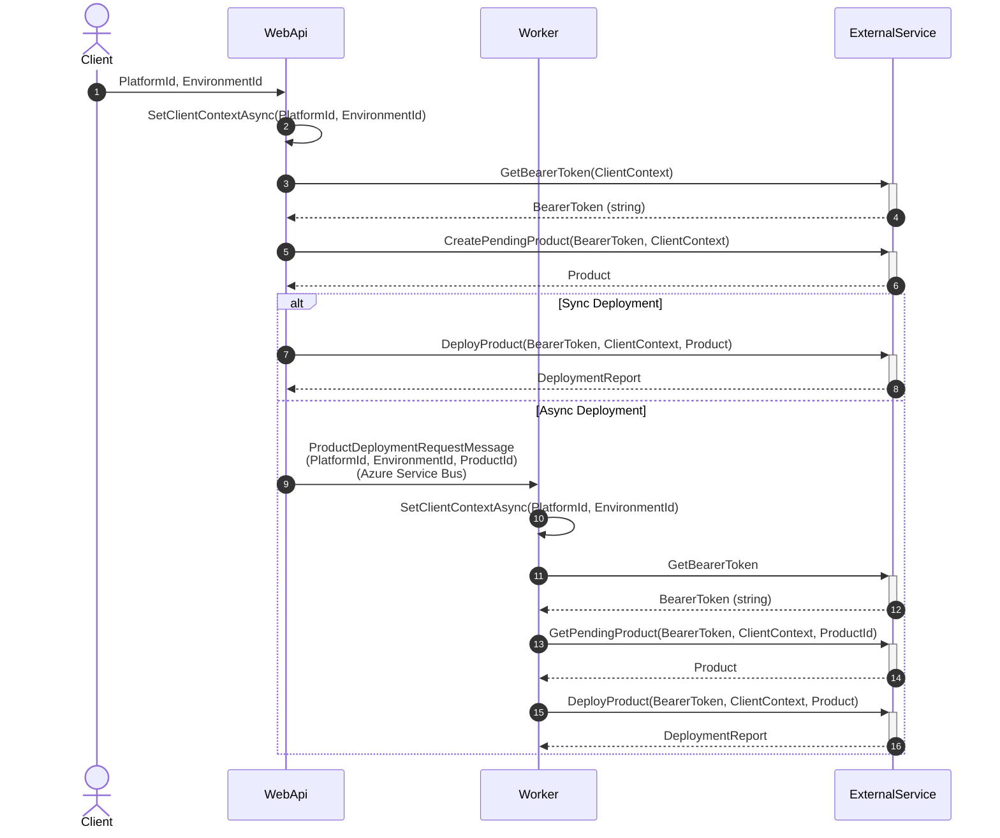

# POC - sharing context accross DI boundary in a Multi-tenancy application

## Problem: sharing context accross DI boundary 

```C#
public class AuthHeaderMiddleware(BearerTokenProvider bearerTokenProvider) : DelegatingHandler
{
	protected override async Task<HttpResponseMessage> SendAsync(HttpRequestMessage request, CancellationToken cancellationToken)
    {
        var token = await _bearerTokenProvider.GetCurrentBearerToken();
        request.Headers.Authorization = new AuthenticationHeaderValue("Bearer", token);
        return await base.SendAsync(request, cancellationToken).ConfigureAwait(false);
    }
}

public class DeploymentConsumer(BearerTokenProvider bearerTokenProvider, IExternalApi refitHttpClient)
    : IConsumer<ProductDeploymentRequestMessage>
{
    public async Task Consume(ConsumeContext<ProductDeploymentRequestMessage> context)
    {
        await _bearerTokenProvider.SetCurrentBearerToken(context.Message);
        await refitHttpClient.CreatePendingProduct(); //it will call the AuthHeaderMiddleware to set the Bearer Token
    }
}

public interface IExternalApi
{
    [Put("/product")]
    Task<Product> CreatePendingProduct();
}

public static void ServiceRegistration(this IServiceCollection services)
{
    services.AddScoped<BearerTokenProvider>();
    services.AddScoped<DeploymentConsumer>();
    services.AddScoped<AuthHeaderMiddleware>();
    services.AddRefit<IExternalApi>().AddHttpMessageHandler<AuthHeaderMiddleware>();
   /*Omitted codes*/
}
```

- `AuthHeaderMiddleware` is a `HttpClient` middleware for outgoing Http requests.
- `DeploymentConsumer` is the handler for the incoming MassTransit's Bus event.
- When `DeploymentConsumer` calls external API, the `AuthHeaderMiddleware` will enrich the Http request with the `CurrentBearerToken`
- The`CurrentBearerToken`is compute in the `DeploymentConsumer` based on the received event.

Problem: the `AuthHeaderMiddleware` and `DeploymentConsumer` are created in 2 different scopes.
- the `AuthHeaderMiddleware` is created by `HttpClientFactory`'s scope
- the `DeploymentConsumer` is created by MassTransit event scope

They didn't share the same `BearerTokenProvider`, so when `DeploymentConsumer` set the `CurrentBearerToken`, `AuthHeaderMiddleware` cannot "see" this value.

## Target application architecture

The following architecture is a simplify version of a real project situation.
The POC focus on solving the above problem:

* The *WebApi* compute a `ClientContext` based on the incoming request
* The *WebApi* uses this `ClientContext` in order to get a `BearerToken` from an external *authentication service* such as "Azure Entra ID" (`GetBearerToken` in the POC)
* Then the *WebApi* would be able to perform some business logic with certain *external service* (`CreatePendingProduct` in the POC).
* Then The *WebApi* sent a message to *Worker* to trigger heavy business logic (`DeployProduct` in the POC).



The *Worker* and *WebApi* shared the same codes in the *Core* project, they both got the same problem:
- the `DeploymentHandler` sets the `ClientContext` (based on the received Bus's event or the incoming Http request). 
But the `AuthHeaderMiddleware` cannot "see" this `ClientContext` because they are in different scopes.

Solution: 
- use `AsyncLocal` to store the `ClientContext` in the `ClientContextProvider` **singleton**.
- the `ClientContextProvider` singleton is similar to the `HttpContextAccessor` singleton.

While `HttpContextAccessor` can only be used in the *WebApi* project, the `ClientContextProvider` can be used in both *WebApi* and *Worker* projects.

## TODO

* test more scenarios, to make sure that there is no other side effect with the `AsyncLocal` solution, such as memory leak, or wrong value in the `ClientContextProvider` when there are multiple concurrent requests/events.
* try other solution: use `ConcurrentDictionary` to replace `AsyncLocal`.

