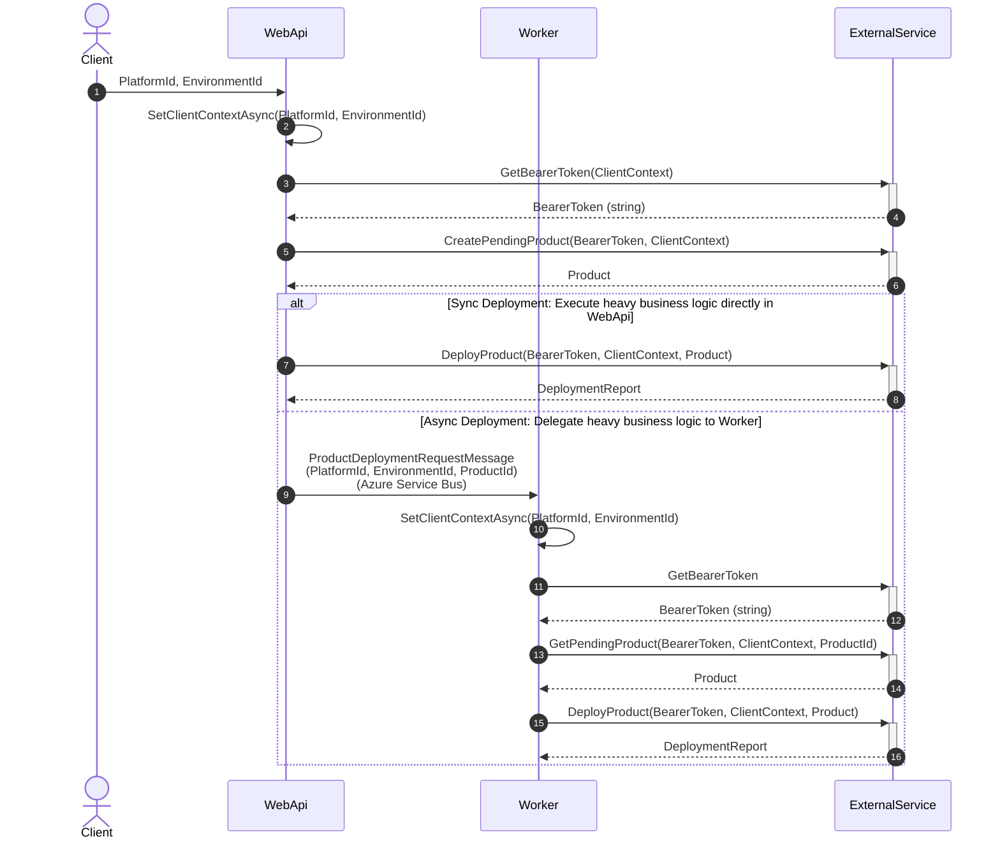

# Proof of Concept for a Real Project

This POC is a simplified imitation of a real project situation. See the *Target application architecture* section for more details.

The POC uses the same tech stack as the target project (Refit, MassTransit / Azure Service Bus, Serilog) to demonstrate solutions for various problems:

**Problem 1**: Sharing context across DI boundaries in a multi-tenancy application (see details in the next section).

**Problem 2**: Delegate heavy tasks to an external Worker via Azure Service Bus Queue (no Pub/Sub) with MassTransit.

**Problem 3**: Instrument telemetry data (logs, traces, and metrics) to Azure Application Insights with Serilog.

For any request to the **WebApi**, we should be able to visualize all access traces from **WebApi** to the **Worker** to the **ExternalApi** to the **Database** in Azure App Insights.


**Problem 4**: Enriching logs with useful context data to facilitate troubleshooting.

  * Attach TraceId to every log entry to correlate related logs across services in Azure Application Insights.
  * Attach username to log entries with [LoggingScope](WebApi/UsernameLoggingMiddleware.cs).
  * Prevent oversized log messages using Serilog configuration and a custom [TruncatingEnricher](WorkerBusDemo.ServiceDefaults/TruncatingEnricher.cs).


## Problem 1: Sharing context across DI boundaries in a multi-tenancy application 

```C#
public class AuthHeaderMiddleware(BearerTokenProvider bearerTokenProvider) : DelegatingHandler
{
	protected override async Task<HttpResponseMessage> SendAsync(HttpRequestMessage request, CancellationToken cancellationToken)
    {
        var token = await _bearerTokenProvider.GetCurrentBearerToken();
        request.Headers.Authorization = new AuthenticationHeaderValue("Bearer", token);
        return await base.SendAsync(request, cancellationToken).ConfigureAwait(false);
    }
}

public class DeploymentConsumer(BearerTokenProvider bearerTokenProvider, IExternalApi refitHttpClient)
    : IConsumer<ProductDeploymentRequestMessage>
{
    public async Task Consume(ConsumeContext<ProductDeploymentRequestMessage> context)
    {
        await _bearerTokenProvider.SetCurrentBearerToken(context.Message);
        await refitHttpClient.CreatePendingProduct(); //it will call the AuthHeaderMiddleware to set the Bearer Token
    }
}

public interface IExternalApi
{
    [Put("/product")]
    Task<Product> CreatePendingProduct();
}

public static void ServiceRegistration(this IServiceCollection services)
{
    services.AddScoped<BearerTokenProvider>();
    services.AddScoped<DeploymentConsumer>();
    services.AddScoped<AuthHeaderMiddleware>();
    services.AddRefit<IExternalApi>().AddHttpMessageHandler<AuthHeaderMiddleware>();
   /*Omitted codes*/
}
```

- `AuthHeaderMiddleware` is an `HttpClient` middleware for outgoing HTTP requests.
- `DeploymentConsumer` is the handler for incoming MassTransit bus events.
- When `DeploymentConsumer` calls the external API, `AuthHeaderMiddleware` enriches the HTTP request with `CurrentBearerToken`.
- `CurrentBearerToken` is computed in `DeploymentConsumer` based on the received event.

Problem: `AuthHeaderMiddleware` and `DeploymentConsumer` are created in different scopes:
- `AuthHeaderMiddleware` is created by `HttpClientFactory`'s scope
- `DeploymentConsumer` is created by MassTransit's event scope

They don't share the same `BearerTokenProvider`, so when `DeploymentConsumer` sets `CurrentBearerToken`, `AuthHeaderMiddleware` cannot access this value.

## Target application architecture

The following architecture is a simplified version of a real project situation.
The POC focuses on solving the above problem:

* The *WebApi* computes a `ClientContext` based on the incoming request
* The *WebApi* uses this `ClientContext` to get a `BearerToken` from an external authentication service such as "Azure Entra ID" (`GetBearerToken` in the POC)
* Then the *WebApi* performs business logic with the external service (`CreatePendingProduct` in the POC)
* Then the *WebApi* sends a message to the *Worker* to trigger heavy business logic (`DeployProduct` in the POC)



The *Worker* and *WebApi* share the same code in the *Core* project; they both have the same problem:
- the `DeploymentHandler` sets the `ClientContext` (based on the received bus event or the incoming HTTP request). 
But the `AuthHeaderMiddleware` cannot "see" this `ClientContext` because they are in different scopes.

Solution: 
- Use `AsyncLocal` to store the `ClientContext` in the `ClientContextProvider` **singleton**.
- The `ClientContextProvider` singleton is similar to `HttpContextAccessor` singleton.

While `HttpContextAccessor` can only be used in the *WebApi* project, the `ClientContextProvider` can be used in both *WebApi* and *Worker* projects.

## TODO

* Test more scenarios to ensure there are no side effects with the `AsyncLocal` solution, such as memory leaks or incorrect values in `ClientContextProvider` when there are multiple concurrent requests/events.
* Try alternative solutions: use `ConcurrentDictionary` to replace `AsyncLocal`.

## How to run

Run/Debug the `WorkerBusDemo.AppHost`project.

The first run will be very slow and probably failed, because it needs to pull the base SQL Server image. Once the image is pulled, subsequent runs will be much faster.

## Conclusion

The POC doesn't follow "Clean Architecture" or any architecture principle, so don't ask. 
It focuses on solving the above problems with minimal idiomatic code.
